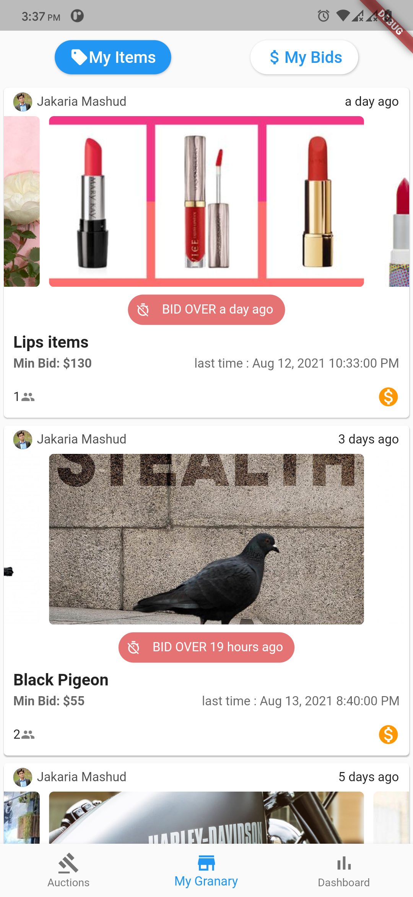

# Haggle BD

An auction Application using flutter and firebase, is in progress instructed by [Taka.school](https://taka.school)

Here is the build release ['APK Click here to Download'](https://doc-0s-9g-docs.googleusercontent.com/docs/securesc/5jode3m2h8c3e9j5kh40oqkd3t33l0rc/s1ufg0090g4pa5c2ml8fd0sjdshvbl7i/1628964300000/08760986305382113051/08760986305382113051/1-fJttyLJTVqCyc2g0AlyZX5GLTFotd5H?e=download&authuser=0&nonce=pndv6iafpalik&user=08760986305382113051&hash=ml3bfcvjq5so5kqub4vot0sbl2fhkmhv).
I have tested it with two Android phones. As far as it is good. But if you get an issue or issues, please let me know.

### Package use:
- firebase_auth
- firebase_cloud_firestore
- firebase_storage
- google_auth

and use different kinds of package for building this application.

## Problem I have faced

I used Flutter more than two years ago, and honestly I am not a flutter stack.
Only I know the basics about. I have totally shifted myself in React and React Native.

Within this two years, many things have been changed of the technology. 
New methods have come to implement.
So if you don't stick on particular thing, it may fall you into some trouble.

But that doesn't mean that you don't know anything, or you can't do any things.
I honestly believe that anyone can do what they have to be effort. 
I have followed the official documentation for working on this project.
Nothing is more helpful than official documentation if it is well documented.
I wish I learn more things, if I stick with this.

- I have found difficulty to mapping firestoreJSONQuery. Mapping any data is easy on JavaScript. but I have figured out the way.
- Others are not so major problem. 

Maybe this is not the good way to build an application.
There has to be some plan how the files and code are organized  well, for that you have to need time for planning.

## Problem you may face
Confirm that you have everything installed correctly for running this project.

- check Flutter SDK
- Android SDK
- JDK
- last thing -> check /haggle/android/local.properties , place there your flutter sdk path.
- install the packages by 'flutter pub get'

## Let see some interface

- Home Page

- Details Page

- Users gallery

- Show users where they make a bid

- in progress ( User Profile )

- Dashboard

- -TimeLine of BidsPricePerDay

## Connect
you can find me on Google by typing my name "Jakaria Mashud Shahria"
if you find any difficulty or need to contact me knock me on whatsapp or [telegram](https:t.me/jakariamsria)
or email me at [jakariamsria@gmail.com](mailto:jakariamsria@gmail.com),
or [shahria@oasisoneiric.tech](mailto:shahria@oasisoneiric.tech)
